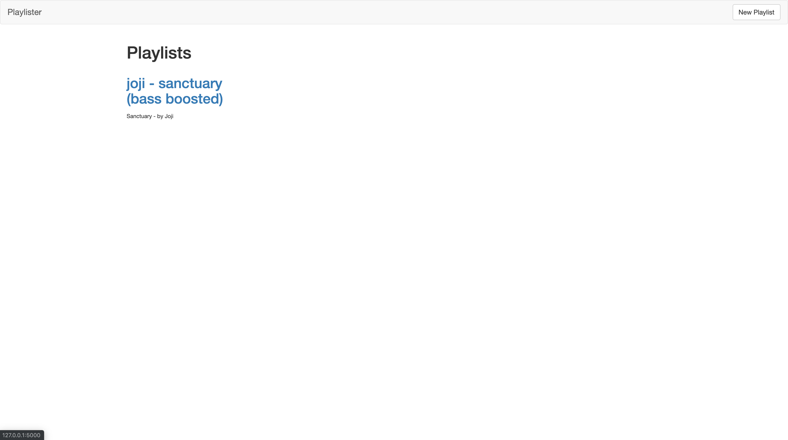
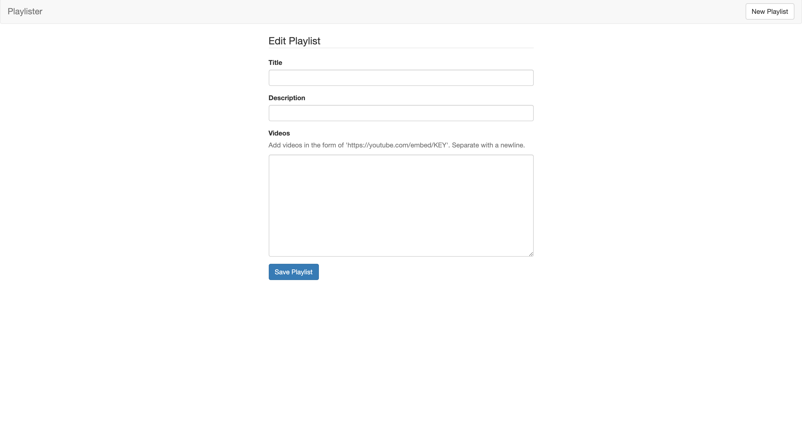
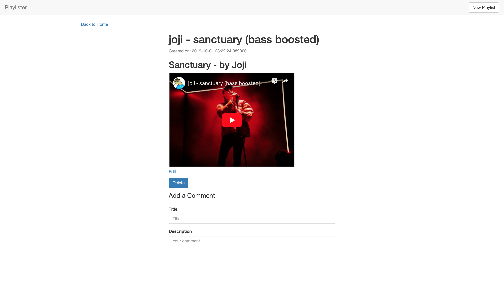

# Playlister Turtorial
Preparing the student for the constructor project where you have to make you're own creative take of a store front

## Playlister
### Home

### Create

### Show


## Struture
```
| - templates: HTML templates for playlister
  |- partials: bootstrap for playlister
| - app.py: the functionality of playlister
| - test.py: tests the roots for playlister project
| - Procfile: Heroku
```

## Use
- Read requirment list an install
- Clone
```
~/playlister(master) export FLASK_ENV=development
~/playlister(master) mongod
~/playlister(master) flask run
```
